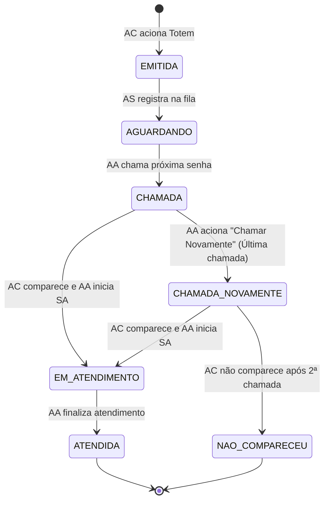
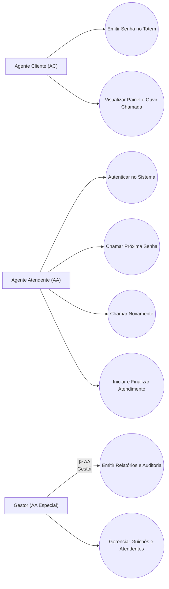
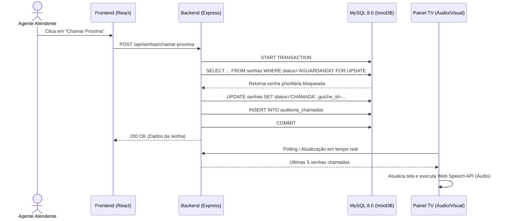

# Diagramas UML — nassauTickets

## 1. Diagrama de Máquina de Estados da Senha

```mermaid
stateDiagram-v2
    [*] --> EMITIDA : AC aciona Totem
    EMITIDA --> AGUARDANDO : AS registra na fila
    AGUARDANDO --> CHAMADA : AA chama próxima senha
    CHAMADA --> CHAMADA_NOVAMENTE : AA aciona "Chamar Novamente" (Última chamada)
    CHAMADA --> EM_ATENDIMENTO : AC comparece e AA inicia SA
    CHAMADA_NOVAMENTE --> EM_ATENDIMENTO : AC comparece e AA inicia SA
    CHAMADA_NOVAMENTE --> NAO_COMPARECEU : AC não comparece após 2ª chamada
    EM_ATENDIMENTO --> ATENDIDA : AA finaliza atendimento
    ATENDIDA --> [*]
    NAO_COMPARECEU --> [*]
```

## 2. Diagrama de Casos de Uso

```mermaid
flowchart LR
    AC["Agente Cliente (AC)"]
    AA["Agente Atendente (AA)"]
    Gestor["Gestor (AA Especial)"]

    UC1(("Emitir Senha no Totem"))
    UC2(("Visualizar Painel e Ouvir Chamada"))
    UC3(("Autenticar no Sistema"))
    UC4(("Chamar Próxima Senha"))
    UC5(("Chamar Novamente"))
    UC6(("Iniciar e Finalizar Atendimento"))
    UC7(("Emitir Relatórios e Auditoria"))
    UC8(("Gerenciar Guichês e Atendentes"))

    AC --> UC1
    AC --> UC2
    AA --> UC3
    AA --> UC4
    AA --> UC5
    AA --> UC6
    Gestor --|> AA
    Gestor --> UC7
    Gestor --> UC8
```

## 3. Diagrama de Sequência — Chamada Concorrente de Senha

```mermaid
sequenceDiagram
    actor AA as Agente Atendente
    participant FE as Frontend (React)
    participant API as Backend (Express)
    participant DB as MySQL 8.0 (InnoDB)
    participant Painel as Painel TV (Áudio/Visual)

    AA->>FE: Clica em "Chamar Próxima"
    FE->>API: POST /api/senhas/chamar-proxima
    API->>DB: START TRANSACTION
    API->>DB: SELECT ... FROM senhas WHERE status='AGUARDANDO' FOR UPDATE
    DB-->>API: Retorna senha prioritária bloqueada
    API->>DB: UPDATE senhas SET status='CHAMADA', guiche_id=...
    API->>DB: INSERT INTO auditoria_chamadas
    API->>DB: COMMIT
    API-->>FE: 200 OK (Dados da senha)
    Painel->>API: Polling / Atualização em tempo real
    API-->>Painel: Últimas 5 senhas chamadas
    Painel->>Painel: Atualiza tela e executa Web Speech API (Áudio)
```
